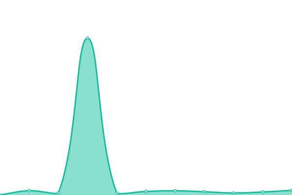

# [📈 Live Status](https://status.piped.video): <!--live status--> **🟧 Partial outage**

This repository contains the open-source uptime monitor and status page for [Team Piped](https://piped.kavin.rocks/), powered by [Upptime](https://github.com/upptime/upptime).

With [Upptime](https://upptime.js.org), you can get your own unlimited and free uptime monitor and status page, powered entirely by a GitHub repository. We use [Issues](https://github.com/TeamPiped/piped-uptime/issues) as incident reports, [Actions](https://github.com/TeamPiped/piped-uptime/actions) as uptime monitors, and [Pages](https://status.piped.video) for the status page.

<!--start: status pages-->
<!-- This summary is generated by Upptime (https://github.com/upptime/upptime) -->
<!-- Do not edit this manually, your changes will be overwritten -->
<!-- prettier-ignore -->
| URL | Status | History | Response Time | Uptime |
| --- | ------ | ------- | ------------- | ------ |
|  [kavin.rocks (Official)](https://pipedapi.kavin.rocks/healthcheck) | 🟩 Up | [kavin-rocks-official.yml](https://github.com/TeamPiped/piped-uptime/commits/HEAD/history/kavin-rocks-official.yml) | 

 523ms
     
 | 

<a href="https://status.piped.video/history/kavin-rocks-official">95.45%</a>
    

|  [tokhmi.xyz](https://pipedapi.tokhmi.xyz/healthcheck) | 🟩 Up | [tokhmi-xyz.yml](https://github.com/TeamPiped/piped-uptime/commits/HEAD/history/tokhmi-xyz.yml) | 

 180ms
     
 | 

<a href="https://status.piped.video/history/tokhmi-xyz">100.00%</a>
    

|  [moomoo.me](https://pipedapi.moomoo.me/healthcheck) | 🟥 Down | [moomoo-me.yml](https://github.com/TeamPiped/piped-uptime/commits/HEAD/history/moomoo-me.yml) | 

 0ms
     
 | 

<a href="https://status.piped.video/history/moomoo-me">0.00%</a>
    

|  [syncpundit.io](https://pipedapi.syncpundit.io/healthcheck) | 🟥 Down | [syncpundit-io.yml](https://github.com/TeamPiped/piped-uptime/commits/HEAD/history/syncpundit-io.yml) | 

 190ms
     
 | 

<a href="https://status.piped.video/history/syncpundit-io">0.00%</a>
    

|  [mha.fi](https://api-piped.mha.fi/healthcheck) | 🟩 Up | [mha-fi.yml](https://github.com/TeamPiped/piped-uptime/commits/HEAD/history/mha-fi.yml) | 

 683ms
     
 | 

<a href="https://status.piped.video/history/mha-fi">100.00%</a>
    

|  [whatever.social](https://watchapi.whatever.social/healthcheck) | 🟩 Up | [whatever-social.yml](https://github.com/TeamPiped/piped-uptime/commits/HEAD/history/whatever-social.yml) | 

 1543ms
     
 | 

<a href="https://status.piped.video/history/whatever-social">99.83%</a>
    

|  [garudalinux.org](https://piped-api.garudalinux.org/healthcheck) | 🟩 Up | [garudalinux-org.yml](https://github.com/TeamPiped/piped-uptime/commits/HEAD/history/garudalinux-org.yml) | 

 2816ms
     
 | 

<a href="https://status.piped.video/history/garudalinux-org">100.00%</a>
    

|  [rivo.lol](https://pipedapi.rivo.lol/healthcheck) | 🟥 Down | [rivo-lol.yml](https://github.com/TeamPiped/piped-uptime/commits/HEAD/history/rivo-lol.yml) | 

 135ms
     
 | 

<a href="https://status.piped.video/history/rivo-lol">0.00%</a>
    

|  [aeong.one](https://pipedapi.aeong.one/healthcheck) | 🟥 Down | [aeong-one.yml](https://github.com/TeamPiped/piped-uptime/commits/HEAD/history/aeong-one.yml) | 

 106ms
     
 | 

<a href="https://status.piped.video/history/aeong-one">0.00%</a>
    

|  [leptons.xyz](https://pipedapi.leptons.xyz/healthcheck) | 🟩 Up | [leptons-xyz.yml](https://github.com/TeamPiped/piped-uptime/commits/HEAD/history/leptons-xyz.yml) | 

 600ms
     
 | 

<a href="https://status.piped.video/history/leptons-xyz">100.00%</a>
    

|  [lunar.icu](https://piped-api.lunar.icu/healthcheck) | 🟩 Up | [lunar-icu.yml](https://github.com/TeamPiped/piped-uptime/commits/HEAD/history/lunar-icu.yml) | 

 547ms
     
 | 

<a href="https://status.piped.video/history/lunar-icu">100.00%</a>
    

|  [dc09.ru](https://ytapi.dc09.ru/healthcheck) | 🟩 Up | [dc09-ru.yml](https://github.com/TeamPiped/piped-uptime/commits/HEAD/history/dc09-ru.yml) | 

 2565ms
     
 | 

<a href="https://status.piped.video/history/dc09-ru">99.56%</a>
    

|  [kozmik.studio](https://pipedapi.kozmik.studio/healthcheck) | 🟩 Up | [kozmik-studio.yml](https://github.com/TeamPiped/piped-uptime/commits/HEAD/history/kozmik-studio.yml) | 

 860ms
     
 | 

<a href="https://status.piped.video/history/kozmik-studio">100.00%</a>
    

|  [kavin.rocks libre (Official)](https://pipedapi-libre.kavin.rocks/healthcheck) | 🟥 Down | [kavin-rocks-libre-official.yml](https://github.com/TeamPiped/piped-uptime/commits/HEAD/history/kavin-rocks-libre-official.yml) | 

 1353ms
     
 | 

<a href="https://status.piped.video/history/kavin-rocks-libre-official">79.23%</a>
    

|  [mint.lgbt](https://pa.mint.lgbt/healthcheck) | 🟩 Up | [mint-lgbt.yml](https://github.com/TeamPiped/piped-uptime/commits/HEAD/history/mint-lgbt.yml) | 

 789ms
     
 | 

<a href="https://status.piped.video/history/mint-lgbt">100.00%</a>
    

|  [il.ax](https://pa.il.ax/healthcheck) | 🟩 Up | [il-ax.yml](https://github.com/TeamPiped/piped-uptime/commits/HEAD/history/il-ax.yml) | 

 345ms
     
 | 

<a href="https://status.piped.video/history/il-ax">100.00%</a>
    

|  [privacy.com.de](https://piped-api.privacy.com.de/healthcheck) | 🟩 Up | [privacy-com-de.yml](https://github.com/TeamPiped/piped-uptime/commits/HEAD/history/privacy-com-de.yml) | 

 768ms
     
 | 

<a href="https://status.piped.video/history/privacy-com-de">100.00%</a>
    

|  [esmailelbob.xyz](https://pipedapi.esmailelbob.xyz/healthcheck) | 🟥 Down | [esmailelbob-xyz.yml](https://github.com/TeamPiped/piped-uptime/commits/HEAD/history/esmailelbob-xyz.yml) | 

 1796ms
     
 | 

<a href="https://status.piped.video/history/esmailelbob-xyz">66.36%</a>
    

|  [projectsegfau.lt](https://api.piped.projectsegfau.lt/healthcheck) | 🟩 Up | [projectsegfau-lt.yml](https://github.com/TeamPiped/piped-uptime/commits/HEAD/history/projectsegfau-lt.yml) | 

 508ms
     
 | 

<a href="https://status.piped.video/history/projectsegfau-lt">100.00%</a>
    

|  [projectsegfau.lt in](https://pipedapi.in.projectsegfau.lt/healthcheck) | 🟩 Up | [projectsegfau-lt-in.yml](https://github.com/TeamPiped/piped-uptime/commits/HEAD/history/projectsegfau-lt-in.yml) | 

 0ms
     
 | 

<a href="https://status.piped.video/history/projectsegfau-lt-in">99.81%</a>
    

|  [projectsegfau.lt us](https://pipedapi.us.projectsegfau.lt/healthcheck) | 🟥 Down | [projectsegfau-lt-us.yml](https://github.com/TeamPiped/piped-uptime/commits/HEAD/history/projectsegfau-lt-us.yml) | 

 251ms
     
 | 

<a href="https://status.piped.video/history/projectsegfau-lt-us">0.00%</a>
    

|  [privacydev.net](https://api.piped.privacydev.net/healthcheck) | 🟩 Up | [privacydev-net.yml](https://github.com/TeamPiped/piped-uptime/commits/HEAD/history/privacydev-net.yml) | 

 2959ms
     
 | 

<a href="https://status.piped.video/history/privacydev-net">88.28%</a>
    

|  [palveluntarjoaja.eu](https://pipedapi.palveluntarjoaja.eu/healthcheck) | 🟩 Up | [palveluntarjoaja-eu.yml](https://github.com/TeamPiped/piped-uptime/commits/HEAD/history/palveluntarjoaja-eu.yml) | 

 802ms
     
 | 

<a href="https://status.piped.video/history/palveluntarjoaja-eu">100.00%</a>
    

|  [smnz.de](https://pipedapi.smnz.de/healthcheck) | 🟩 Up | [smnz-de.yml](https://github.com/TeamPiped/piped-uptime/commits/HEAD/history/smnz-de.yml) | 

 828ms
     
 | 

<a href="https://status.piped.video/history/smnz-de">99.51%</a>
    

|  [adminforge.de](https://pipedapi.adminforge.de/healthcheck) | 🟩 Up | [adminforge-de.yml](https://github.com/TeamPiped/piped-uptime/commits/HEAD/history/adminforge-de.yml) | 

 637ms
     
 | 

<a href="https://status.piped.video/history/adminforge-de">99.71%</a>
    

|  [qdi.fi](https://pipedapi.qdi.fi/healthcheck) | 🟩 Up | [qdi-fi.yml](https://github.com/TeamPiped/piped-uptime/commits/HEAD/history/qdi-fi.yml) | 

 337ms
     
 | 

<a href="https://status.piped.video/history/qdi-fi">100.00%</a>
    

|  [hostux.net](https://piped-api.hostux.net/healthcheck) | 🟩 Up | [hostux-net.yml](https://github.com/TeamPiped/piped-uptime/commits/HEAD/history/hostux-net.yml) | 

 365ms
     
 | 

<a href="https://status.piped.video/history/hostux-net">98.76%</a>
    

|  [vern.cc](https://pdapi.vern.cc/healthcheck) | 🟥 Down | [vern-cc.yml](https://github.com/TeamPiped/piped-uptime/commits/HEAD/history/vern-cc.yml) | 

 0ms
     
 | 

<a href="https://status.piped.video/history/vern-cc">0.00%</a>
    

|  [chauvet.pro](https://pipedapi.chauvet.pro/healthcheck) | 🟩 Up | [chauvet-pro.yml](https://github.com/TeamPiped/piped-uptime/commits/HEAD/history/chauvet-pro.yml) | 

 823ms
     
 | 

<a href="https://status.piped.video/history/chauvet-pro">100.00%</a>
    

|  [berryez.xyz](https://pipedapi.berryez.xyz/healthcheck) | 🟥 Down | [berryez-xyz.yml](https://github.com/TeamPiped/piped-uptime/commits/HEAD/history/berryez-xyz.yml) | 

 0ms
     
 | 

<a href="https://status.piped.video/history/berryez-xyz">0.00%</a>
    

|  [jotoma.de](https://pipedapi.jotoma.de/healthcheck) | 🟩 Up | [jotoma-de.yml](https://github.com/TeamPiped/piped-uptime/commits/HEAD/history/jotoma-de.yml) | 

 604ms
     
 | 

<a href="https://status.piped.video/history/jotoma-de">100.00%</a>
    

|  [pfcd.me](https://pipedapi.pfcd.me/healthcheck) | 🟩 Up | [pfcd-me.yml](https://github.com/TeamPiped/piped-uptime/commits/HEAD/history/pfcd-me.yml) | 

 393ms
     
 | 

<a href="https://status.piped.video/history/pfcd-me">99.13%</a>
    

|  [frontendfriendly.xyz](https://pipedapi.frontendfriendly.xyz/healthcheck) | 🟩 Up | [frontendfriendly-xyz.yml](https://github.com/TeamPiped/piped-uptime/commits/HEAD/history/frontendfriendly-xyz.yml) | 

 201ms
     
 | 

<a href="https://status.piped.video/history/frontendfriendly-xyz">100.00%</a>
    

<!--end: status pages-->

[**Visit our status website →**](https://status.piped.video)

## 📄 License

- Powered by: [Upptime](https://github.com/upptime/upptime)
- Code: [MIT](./LICENSE) © [Team Piped](https://piped.kavin.rocks/)
- Data in the `./history` directory: [Open Database License](https://opendatacommons.org/licenses/odbl/1-0/)
