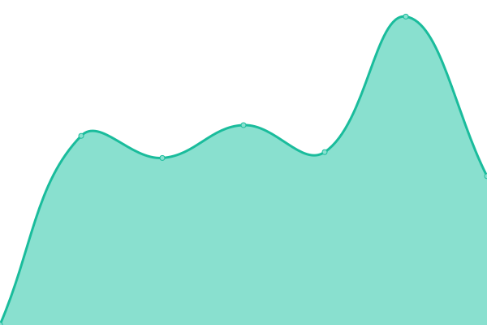

# [📈 Live Status](https://status.piped.video): <!--live status--> **🟧 Partial outage**

This repository contains the open-source uptime monitor and status page for [Team Piped](https://piped.kavin.rocks/), powered by [Upptime](https://github.com/upptime/upptime).

With [Upptime](https://upptime.js.org), you can get your own unlimited and free uptime monitor and status page, powered entirely by a GitHub repository. We use [Issues](https://github.com/TeamPiped/piped-uptime/issues) as incident reports, [Actions](https://github.com/TeamPiped/piped-uptime/actions) as uptime monitors, and [Pages](https://status.piped.video) for the status page.

<!--start: status pages-->
<!-- This summary is generated by Upptime (https://github.com/upptime/upptime) -->
<!-- Do not edit this manually, your changes will be overwritten -->
<!-- prettier-ignore -->
| URL | Status | History | Response Time | Uptime |
| --- | ------ | ------- | ------------- | ------ |
|  [kavin.rocks (Official)](https://pipedapi.kavin.rocks/healthcheck) | 🟩 Up | [kavin-rocks-official.yml](https://github.com/TeamPiped/piped-uptime/commits/HEAD/history/kavin-rocks-official.yml) | 

 392ms
     
 | 

<a href="https://status.piped.video/history/kavin-rocks-official">100.00%</a>
    

|  [tokhmi.xyz](https://pipedapi.tokhmi.xyz/healthcheck) | 🟥 Down | [tokhmi-xyz.yml](https://github.com/TeamPiped/piped-uptime/commits/HEAD/history/tokhmi-xyz.yml) | 

 194ms
     
 | 

<a href="https://status.piped.video/history/tokhmi-xyz">0.00%</a>
    

|  [moomoo.me](https://pipedapi.moomoo.me/healthcheck) | 🟥 Down | [moomoo-me.yml](https://github.com/TeamPiped/piped-uptime/commits/HEAD/history/moomoo-me.yml) | 

 281ms
     
 | 

<a href="https://status.piped.video/history/moomoo-me">0.00%</a>
    

|  [syncpundit.io](https://pipedapi.syncpundit.io/healthcheck) | 🟥 Down | [syncpundit-io.yml](https://github.com/TeamPiped/piped-uptime/commits/HEAD/history/syncpundit-io.yml) | 

 163ms
     
 | 

<a href="https://status.piped.video/history/syncpundit-io">0.00%</a>
    

|  [mha.fi](https://api-piped.mha.fi/healthcheck) | 🟥 Down | [mha-fi.yml](https://github.com/TeamPiped/piped-uptime/commits/HEAD/history/mha-fi.yml) | 

 729ms
     
 | 

<a href="https://status.piped.video/history/mha-fi">0.00%</a>
    

|  [garudalinux.org](https://piped-api.garudalinux.org/healthcheck) | 🟥 Down | [garudalinux-org.yml](https://github.com/TeamPiped/piped-uptime/commits/HEAD/history/garudalinux-org.yml) | 

 0ms
     
 | 

<a href="https://status.piped.video/history/garudalinux-org">0.00%</a>
    

|  [rivo.lol](https://pipedapi.rivo.lol/healthcheck) | 🟥 Down | [rivo-lol.yml](https://github.com/TeamPiped/piped-uptime/commits/HEAD/history/rivo-lol.yml) | 

 0ms
     
 | 

<a href="https://status.piped.video/history/rivo-lol">0.00%</a>
    

|  [leptons.xyz](https://pipedapi.leptons.xyz/healthcheck) | 🟥 Down | [leptons-xyz.yml](https://github.com/TeamPiped/piped-uptime/commits/HEAD/history/leptons-xyz.yml) | 

 103ms
     
 | 

<a href="https://status.piped.video/history/leptons-xyz">0.00%</a>
    

|  [lunar.icu](https://piped-api.lunar.icu/healthcheck) | 🟩 Up | [lunar-icu.yml](https://github.com/TeamPiped/piped-uptime/commits/HEAD/history/lunar-icu.yml) | 

 505ms
     
 | 

<a href="https://status.piped.video/history/lunar-icu">100.00%</a>
    

|  [dc09.ru](https://ytapi.dc09.ru/healthcheck) | 🟥 Down | [dc09-ru.yml](https://github.com/TeamPiped/piped-uptime/commits/HEAD/history/dc09-ru.yml) | 

 0ms
     
 | 

<a href="https://status.piped.video/history/dc09-ru">0.00%</a>
    

|  [colinslegacy.com](https://pipedapi.colinslegacy.com/healthcheck) | 🟥 Down | [colinslegacy-com.yml](https://github.com/TeamPiped/piped-uptime/commits/HEAD/history/colinslegacy-com.yml) | 

 0ms
     
 | 

<a href="https://status.piped.video/history/colinslegacy-com">0.00%</a>
    

|  [vyper.me](https://yapi.vyper.me/healthcheck) | 🟩 Up | [vyper-me.yml](https://github.com/TeamPiped/piped-uptime/commits/HEAD/history/vyper-me.yml) | 

 1228ms
     
 | 

<a href="https://status.piped.video/history/vyper-me">100.00%</a>
    

|  [looleh.xyz](https://api.looleh.xyz/healthcheck) | 🟥 Down | [looleh-xyz.yml](https://github.com/TeamPiped/piped-uptime/commits/HEAD/history/looleh-xyz.yml) | 

 10346ms
     
 | 

<a href="https://status.piped.video/history/looleh-xyz">0.00%</a>
    

|  [cfe.re](https://piped-api.cfe.re/healthcheck) | 🟥 Down | [cfe-re.yml](https://github.com/TeamPiped/piped-uptime/commits/HEAD/history/cfe-re.yml) | 

 0ms
     
 | 

<a href="https://status.piped.video/history/cfe-re">0.00%</a>
    

|  [r4fo.com](https://pipedapi.r4fo.com/healthcheck) | 🟥 Down | [r4fo-com.yml](https://github.com/TeamPiped/piped-uptime/commits/HEAD/history/r4fo-com.yml) | 

 106ms
     
 | 

<a href="https://status.piped.video/history/r4fo-com">0.00%</a>
    

|  [nosebs.ru](https://pipedapi.nosebs.ru/healthcheck) | 🟥 Down | [nosebs-ru.yml](https://github.com/TeamPiped/piped-uptime/commits/HEAD/history/nosebs-ru.yml) | 

 0ms
     
 | 

<a href="https://status.piped.video/history/nosebs-ru">0.00%</a>
    

|  [kavin.rocks libre (Official)](https://pipedapi-libre.kavin.rocks/healthcheck) | 🟩 Up | [kavin-rocks-libre-official.yml](https://github.com/TeamPiped/piped-uptime/commits/HEAD/history/kavin-rocks-libre-official.yml) | 

 497ms
     
 | 

<a href="https://status.piped.video/history/kavin-rocks-libre-official">100.00%</a>
    

|  [mint.lgbt](https://pa.mint.lgbt/healthcheck) | 🟥 Down | [mint-lgbt.yml](https://github.com/TeamPiped/piped-uptime/commits/HEAD/history/mint-lgbt.yml) | 

 0ms
     
 | 

<a href="https://status.piped.video/history/mint-lgbt">0.00%</a>
    

|  [il.ax](https://pa.il.ax/healthcheck) | 🟥 Down | [il-ax.yml](https://github.com/TeamPiped/piped-uptime/commits/HEAD/history/il-ax.yml) | 

 1403ms
     
 | 

<a href="https://status.piped.video/history/il-ax">86.17%</a>
    

|  [privacy.com.de](https://piped-api.privacy.com.de/healthcheck) | 🟥 Down | [privacy-com-de.yml](https://github.com/TeamPiped/piped-uptime/commits/HEAD/history/privacy-com-de.yml) | 

 0ms
     
 | 

<a href="https://status.piped.video/history/privacy-com-de">0.00%</a>
    

|  [projectsegfau.lt](https://api.piped.projectsegfau.lt/healthcheck) | 🟩 Up | [projectsegfau-lt.yml](https://github.com/TeamPiped/piped-uptime/commits/HEAD/history/projectsegfau-lt.yml) | 

 810ms
     
 | 

<a href="https://status.piped.video/history/projectsegfau-lt">87.83%</a>
    

|  [projectsegfau.lt in](https://pipedapi.in.projectsegfau.lt/healthcheck) | 🟩 Up | [projectsegfau-lt-in.yml](https://github.com/TeamPiped/piped-uptime/commits/HEAD/history/projectsegfau-lt-in.yml) | 

 0ms
     
 | 

<a href="https://status.piped.video/history/projectsegfau-lt-in">80.13%</a>
    

|  [projectsegfau.lt us](https://pipedapi.us.projectsegfau.lt/healthcheck) | 🟥 Down | [projectsegfau-lt-us.yml](https://github.com/TeamPiped/piped-uptime/commits/HEAD/history/projectsegfau-lt-us.yml) | 

 0ms
     
 | 

<a href="https://status.piped.video/history/projectsegfau-lt-us">0.00%</a>
    

|  [whatever.social](https://watchapi.whatever.social/healthcheck) | 🟥 Down | [whatever-social.yml](https://github.com/TeamPiped/piped-uptime/commits/HEAD/history/whatever-social.yml) | 

 0ms
     
 | 

<a href="https://status.piped.video/history/whatever-social">0.00%</a>
    

|  [privacydev.net](https://api.piped.privacydev.net/healthcheck) | 🟩 Up | [privacydev-net.yml](https://github.com/TeamPiped/piped-uptime/commits/HEAD/history/privacydev-net.yml) | 

 4442ms
     
 | 

<a href="https://status.piped.video/history/privacydev-net">77.58%</a>
    

|  [palveluntarjoaja.eu](https://pipedapi.palveluntarjoaja.eu/healthcheck) | 🟩 Up | [palveluntarjoaja-eu.yml](https://github.com/TeamPiped/piped-uptime/commits/HEAD/history/palveluntarjoaja-eu.yml) | 

 367ms
     
 | 

<a href="https://status.piped.video/history/palveluntarjoaja-eu">100.00%</a>
    

|  [smnz.de](https://pipedapi.smnz.de/healthcheck) | 🟩 Up | [smnz-de.yml](https://github.com/TeamPiped/piped-uptime/commits/HEAD/history/smnz-de.yml) | 

 627ms
     
 | 

<a href="https://status.piped.video/history/smnz-de">100.00%</a>
    

|  [adminforge.de](https://pipedapi.adminforge.de/healthcheck) | 🟩 Up | [adminforge-de.yml](https://github.com/TeamPiped/piped-uptime/commits/HEAD/history/adminforge-de.yml) | 

 953ms
     
 | 

<a href="https://status.piped.video/history/adminforge-de">99.41%</a>
    

|  [qdi.fi](https://pipedapi.qdi.fi/healthcheck) | 🟥 Down | [qdi-fi.yml](https://github.com/TeamPiped/piped-uptime/commits/HEAD/history/qdi-fi.yml) | 

 0ms
     
 | 

<a href="https://status.piped.video/history/qdi-fi">0.00%</a>
    

|  [hostux.net](https://piped-api.hostux.net/healthcheck) | 🟥 Down | [hostux-net.yml](https://github.com/TeamPiped/piped-uptime/commits/HEAD/history/hostux-net.yml) | 

 0ms
     
 | 

<a href="https://status.piped.video/history/hostux-net">0.00%</a>
    

|  [vern.cc](https://pdapi.vern.cc/healthcheck) | 🟥 Down | [vern-cc.yml](https://github.com/TeamPiped/piped-uptime/commits/HEAD/history/vern-cc.yml) | 

 238ms
     
 | 

<a href="https://status.piped.video/history/vern-cc">0.00%</a>
    

|  [pfcd.me](https://pipedapi.pfcd.me/healthcheck) | 🟥 Down | [pfcd-me.yml](https://github.com/TeamPiped/piped-uptime/commits/HEAD/history/pfcd-me.yml) | 

 99ms
     
 | 

<a href="https://status.piped.video/history/pfcd-me">0.00%</a>
    

|  [frontendfriendly.xyz](https://pipedapi.frontendfriendly.xyz/healthcheck) | 🟩 Up | [frontendfriendly-xyz.yml](https://github.com/TeamPiped/piped-uptime/commits/HEAD/history/frontendfriendly-xyz.yml) | 

 496ms
     
 | 

<a href="https://status.piped.video/history/frontendfriendly-xyz">99.13%</a>
    

|  [piped.yt](https://api.piped.yt/healthcheck) | 🟩 Up | [piped-yt.yml](https://github.com/TeamPiped/piped-uptime/commits/HEAD/history/piped-yt.yml) | 

 512ms
     
 | 

<a href="https://status.piped.video/history/piped-yt">47.30%</a>
    

|  [astartes.nl](https://pipedapi.astartes.nl/healthcheck) | 🟩 Up | [astartes-nl.yml](https://github.com/TeamPiped/piped-uptime/commits/HEAD/history/astartes-nl.yml) | 

 1786ms
     
 | 

<a href="https://status.piped.video/history/astartes-nl">100.00%</a>
    

|  [osphost.fi](https://pipedapi.osphost.fi/healthcheck) | 🟥 Down | [osphost-fi.yml](https://github.com/TeamPiped/piped-uptime/commits/HEAD/history/osphost-fi.yml) | 

 589ms
     
 | 

<a href="https://status.piped.video/history/osphost-fi">0.00%</a>
    

|  [simpleprivacy.fr](https://pipedapi.simpleprivacy.fr/healthcheck) | 🟥 Down | [simpleprivacy-fr.yml](https://github.com/TeamPiped/piped-uptime/commits/HEAD/history/simpleprivacy-fr.yml) | 

 299ms
     
 | 

<a href="https://status.piped.video/history/simpleprivacy-fr">0.00%</a>
    

|  [drgns.space](https://pipedapi.drgns.space/healthcheck) | 🟩 Up | [drgns-space.yml](https://github.com/TeamPiped/piped-uptime/commits/HEAD/history/drgns-space.yml) | 

 286ms
     
 | 

<a href="https://status.piped.video/history/drgns-space">100.00%</a>
    

|  [ggtyler.dev](https://piapi.ggtyler.dev/healthcheck) | 🟩 Up | [ggtyler-dev.yml](https://github.com/TeamPiped/piped-uptime/commits/HEAD/history/ggtyler-dev.yml) | 

 1310ms
     
 | 

<a href="https://status.piped.video/history/ggtyler-dev">0.00%</a>
    

|  [pluto.lat](https://api.watch.pluto.lat/healthcheck) | 🟥 Down | [pluto-lat.yml](https://github.com/TeamPiped/piped-uptime/commits/HEAD/history/pluto-lat.yml) | 

 0ms
     
 | 

<a href="https://status.piped.video/history/pluto-lat">0.00%</a>
    

|  [seitan-ayoub.lol](https://piped-backend.seitan-ayoub.lol/healthcheck) | 🟥 Down | [seitan-ayoub-lol.yml](https://github.com/TeamPiped/piped-uptime/commits/HEAD/history/seitan-ayoub-lol.yml) | 

 0ms
     
 | 

<a href="https://status.piped.video/history/seitan-ayoub-lol">0.00%</a>
    

|  [owo.si](https://pipedapi.owo.si/healthcheck) | 🟥 Down | [owo-si.yml](https://github.com/TeamPiped/piped-uptime/commits/HEAD/history/owo-si.yml) | 

 592ms
     
 | 

<a href="https://status.piped.video/history/owo-si">0.00%</a>
    

|  [minionflo.net](https://api.piped.minionflo.net/healthcheck) | 🟩 Up | [minionflo-net.yml](https://github.com/TeamPiped/piped-uptime/commits/HEAD/history/minionflo-net.yml) | 

 643ms
     
 | 

<a href="https://status.piped.video/history/minionflo-net">99.72%</a>
    

|  [nezumi.party](https://pipedapi.nezumi.party/healthcheck) | 🟥 Down | [nezumi-party.yml](https://github.com/TeamPiped/piped-uptime/commits/HEAD/history/nezumi-party.yml) | 

 0ms
     
 | 

<a href="https://status.piped.video/history/nezumi-party">0.00%</a>
    

|  [ducks.party](https://pipedapi.ducks.party/healthcheck) | 🟩 Up | [ducks-party.yml](https://github.com/TeamPiped/piped-uptime/commits/HEAD/history/ducks-party.yml) | 

 433ms
     
 | 

<a href="https://status.piped.video/history/ducks-party">98.93%</a>
    

|  [ngn.tf](https://pipedapi.ngn.tf/healthcheck) | 🟩 Up | [ngn-tf.yml](https://github.com/TeamPiped/piped-uptime/commits/HEAD/history/ngn-tf.yml) | 

 864ms
     
 | 

<a href="https://status.piped.video/history/ngn-tf">75.02%</a>
    

|  [coldforge.xyz](https://pipedapi.coldforge.xyz/healthcheck) | 🟩 Up | [coldforge-xyz.yml](https://github.com/TeamPiped/piped-uptime/commits/HEAD/history/coldforge-xyz.yml) | 

 247ms
     
 | 

<a href="https://status.piped.video/history/coldforge-xyz">85.16%</a>
    

|  [codespace.cz](https://piped-api.codespace.cz/healthcheck) | 🟩 Up | [codespace-cz.yml](https://github.com/TeamPiped/piped-uptime/commits/HEAD/history/codespace-cz.yml) | 

 3294ms
     
 | 

<a href="https://status.piped.video/history/codespace-cz">95.03%</a>
    

|  [reallyaweso.me](https://pipedapi.reallyaweso.me/healthcheck) | 🟩 Up | [reallyaweso-me.yml](https://github.com/TeamPiped/piped-uptime/commits/HEAD/history/reallyaweso-me.yml) | 

 363ms
     
 | 

<a href="https://status.piped.video/history/reallyaweso-me">95.95%</a>
    

|  [phoenixthrush.com](https://pipedapi.phoenixthrush.com/healthcheck) | 🟩 Up | [phoenixthrush-com.yml](https://github.com/TeamPiped/piped-uptime/commits/HEAD/history/phoenixthrush-com.yml) | 

 4188ms
     
 | 

<a href="https://status.piped.video/history/phoenixthrush-com">95.68%</a>
    

|  [private.coffee](https://api.piped.private.coffee/healthcheck) | 🟩 Up | [private-coffee.yml](https://github.com/TeamPiped/piped-uptime/commits/HEAD/history/private-coffee.yml) | 

 1002ms
     
 | 

<a href="https://status.piped.video/history/private-coffee">100.00%</a>
    

|  [ehwurscht.at](https://schaunapi.ehwurscht.at/healthcheck) | 🟩 Up | [ehwurscht-at.yml](https://github.com/TeamPiped/piped-uptime/commits/HEAD/history/ehwurscht-at.yml) | 

 533ms
     
 | 

<a href="https://status.piped.video/history/ehwurscht-at">99.82%</a>
    

|  [dedyn.io](https://pipedapi.dedyn.io/healthcheck) | 🟩 Up | [dedyn-io.yml](https://github.com/TeamPiped/piped-uptime/commits/HEAD/history/dedyn-io.yml) | 

 431ms
     
 | 

<a href="https://status.piped.video/history/dedyn-io">25.26%</a>
    

|  [darkness.services](https://pipedapi.darkness.services/healthcheck) | 🟥 Down | [darkness-services.yml](https://github.com/TeamPiped/piped-uptime/commits/HEAD/history/darkness-services.yml) | 

 3533ms
     
 | 

<a href="https://status.piped.video/history/darkness-services">78.33%</a>
    

|  [andreafortuna.org](https://pipedapi.andreafortuna.org/healthcheck) | 🟥 Down | [andreafortuna-org.yml](https://github.com/TeamPiped/piped-uptime/commits/HEAD/history/andreafortuna-org.yml) | 

 0ms
     
 | 

<a href="https://status.piped.video/history/andreafortuna-org">0.00%</a>
    

<!--end: status pages-->

[**Visit our status website →**](https://status.piped.video)

## 📄 License

- Powered by: [Upptime](https://github.com/upptime/upptime)
- Code: [MIT](./LICENSE) © [Team Piped](https://piped.kavin.rocks/)
- Data in the `./history` directory: [Open Database License](https://opendatacommons.org/licenses/odbl/1-0/)
